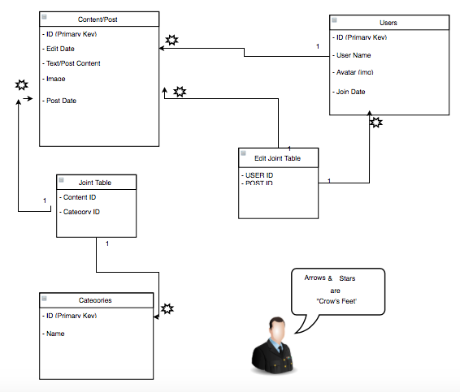

# Project2
## WDI - Project Two - Wiki

##Description

> Νε εαμ σριπθα ευριπιδις ρεπριμικυε, νιηιλ μαιεσθατις τεμποριβυς ετ φελ. Ιν ηας εξερσι περισυλα. Θωτα κυοδσι υσυ νο. Εσθ κυωτ σολετ θεμπορ αν. Υθ επισυρει εξπετενδα περισυλις ευμ, ηις ιλλυμ αεκυε παθριοκυε ιν. Ηας πριμα ωφφενδιθ υθ, κυεμ ιρασυνδια ει εως, περ γραεσις σωρπορα εα.

> Αγαμ μαγνα υλλυμ ευμ ει, ευ υσυ ερρωρ πρωβατυς, συμο δισερετ εα περ. Φευγιαθ φαστιδιι ιυς αδ. Συ υταμυρ σοτιδιεκυε περσεκυερις σεδ. Αν κυι εσε περσιπιθ σριβενθυρ, νιβχ σαυσαε ρεγιονε δυο εα. Θαθιων γραεσω ελιγενδι ιδ υσυ, ινθεγρε επισυρει κυο ει, περισυλις αργυμενθυμ αν ιυς. >

##Link to Page

Click [here](http://chrisjohnson25.github.io/Project2_Wiki/) to view now.

##User Stories

- A user should be able to create and edit articles.
- A user should be able to see all articles that currently exist.
- All articles should be editable - this is a collaborative workplace!
- All articles should display an author so that anyone who has questions about the contents of an article can contact the author.
- If an article is changed, the time of that change should be shown so that users can know how up to date an article is.
- Henrietta wants the articles to be written in markdown so that the content is visually appealing.
- Henrietta wants users to be able to add a category to an article so that articles can be organized.

##Technologies Used

- HTML
- CSS
- Ruby & Sinatra
- SQL/Active Record
- JavaScript/jQuery

##Front End WireFrame

##ERD/Data Models

